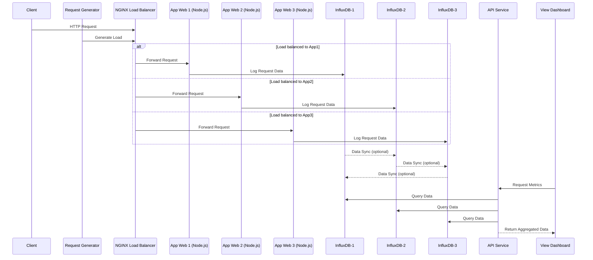

## Hệ thống giám sát lưu lượng request thời gian thực trong mô hình web phân tán sử dụng InfluxDB và Docker

---

### 1. Kiến trúc hệ thống (System Architecture Diagram)



### 2. Mô tả các thành phần trong hệ thống

**Client:**

- Người dùng hoặc chương trình tạo request đến hệ thống qua NGINX.

**NGINX Load Balancer:**

- Cân bằng tải giữa 3 web server (app-1, app-2, app-3) theo round-robin hoặc IP-hash.

- Giúp phân phối đồng đều request vào backend, đảm bảo không có server nào bị quá tải.

**App Web 1, 2, 3 (Node.js):**

- Mỗi container Node.js xử lý request đến từ NGINX.

- Sau mỗi request, ghi log hoặc thống kê số lượng request vào InfluxDB tương ứng (influxdb-1, influxdb-2, influxdb-3).

- Có thể định danh mỗi server bằng biến môi trường NAME.

**InfluxDB 1, 2, 3:**

- Mỗi app có 1 cơ sở dữ liệu riêng biệt để lưu trữ lượng truy cập (theo mô hình sharding phân tầng).

- Các InfluxDB có thể liên kết (cluster hoặc liên thông) để thực hiện tổng hợp dữ liệu nếu cần.

- Dữ liệu gồm các trường: timestamp, count, server_name, path,...

**API:**

- Dịch vụ trung gian dùng để đọc dữ liệu từ InfluxDB.

- Truy vấn từ cả 3 DB (hoặc tổng hợp dữ liệu) để gửi về client UI.

**View:**

- Giao diện người dùng (frontend) để trực quan hóa dữ liệu (sử dụng biểu đồ, số liệu, v.v.).

**Request:**

- Module tự động sinh request mô phỏng người dùng thật.

- Gửi request tuần tự hoặc ngẫu nhiên qua NGINX để đo lượng tải phân phối.

### 3. Công nghệ và thư viện sử dụng

| Thành phần       | Công nghệ                                             | Lý do chọn                                                                 |
| ---------------- | ----------------------------------------------------- | -------------------------------------------------------------------------- |
| Load Balancer    | NGINX                                                 | Nhẹ, dễ cấu hình, phổ biến trong hệ phân tán                               |
| Backend Web      | Node.js                                               | Dễ viết API, async tốt, phù hợp với xử lý nhẹ                              |
| Monitoring DB    | InfluxDB                                              | Chuyên biệt cho dữ liệu chuỗi thời gian, hỗ trợ đo đạc chính xác theo giây |
| Containerization | Docker + Docker Compose                               | Dễ triển khai, tách biệt các thành phần, tiện kiểm thử                     |
| Visualization    | Tự viết hoặc dùng thư viện Chart.js                   | Hiển thị dữ liệu trực quan                                                 |
| API Query        | InfluxDB client (Node.js @influxdata/influxdb-client) | Kết nối tới InfluxDB qua HTTP API                                          |

### 4. Mô hình dữ liệu (Database Model)

#### 📌 Measurement: `web-requests`

Mỗi lần client gửi request đến app web, middleware `requestLogger` sẽ tự động ghi một bản ghi (`Point`) vào InfluxDB. Bản ghi này chứa thông tin về request như method, đường dẫn, port xử lý, mã phản hồi HTTP và thời gian phản hồi.

---

#### 🔹 Cấu trúc bản ghi

##### **Tags** (dùng để lọc hoặc nhóm truy vấn):

| Tên tag  | Kiểu dữ liệu | Mô tả                                                |
| -------- | ------------ | ---------------------------------------------------- |
| `method` | String       | HTTP method (`GET`, `POST`, ...)                     |
| `path`   | String       | Đường dẫn được truy cập (`/home`, `/login`, ...)     |
| `port`   | String       | Cổng ứng dụng xử lý request (`3001`, `3002`, `3003`) |

##### **Fields** (dùng để thống kê, tổng hợp):

| Tên field     | Kiểu dữ liệu | Mô tả                                            |
| ------------- | ------------ | ------------------------------------------------ |
| `status`      | Integer      | Mã phản hồi HTTP (`200`, `404`, `500`, ...)      |
| `duration_ms` | Float        | Thời gian xử lý request (tính bằng milliseconds) |

##### **Timestamp**:

- InfluxDB sẽ tự động gán thời gian hiện tại khi ghi dữ liệu nếu không chỉ định rõ.

---

#### 🔹 Ví dụ mẫu dữ liệu ghi vào InfluxDB:

| time                     | method | path   | port | status | duration_ms |
| ------------------------ | ------ | ------ | ---- | ------ | ----------- |
| 2025-05-18T14:00:01.100Z | GET    | /home  | 3001 | 200    | 2.34        |
| 2025-05-18T14:00:01.150Z | POST   | /login | 3002 | 401    | 5.12        |
| 2025-05-18T14:00:01.210Z | GET    | /data  | 3003 | 200    | 1.98        |

---

#### 🔹 Middleware ghi dữ liệu: `requestLogger`

```js
const { writeApi, Point } = require('./influx');

function requestLogger(req, res, next) {
	const start = process.hrtime();

	res.on('finish', () => {
		const diff = process.hrtime(start);
		const durationMs = diff[0] * 1000 + diff[1] / 1e6;

		const point = new Point('web-requests')
			.tag('method', req.method)
			.tag('path', req.path)
			.tag('port', process.env.PORT)
			.intField('status', res.statusCode)
			.floatField('duration_ms', durationMs);

		writeApi.writePoint(point);
	});

	next();
}

module.exports = requestLogger;
```

## 5. Chiến lược triển khai và cấu hình hệ thống

### 🐳 Docker & Docker Compose

Hệ thống được triển khai hoàn toàn bằng Docker thông qua một file `docker-compose.yml`. Mỗi thành phần trong hệ thống được đóng gói trong một container riêng biệt, đảm bảo tính độc lập, dễ mở rộng và dễ quản lý.

---

### 📦 Các thành phần chính trong `docker-compose.yml`:

#### 1. **influxdb-1, influxdb-2, influxdb-3**

- Ba container InfluxDB hoạt động độc lập, mỗi container tương ứng với một app web.
- Dữ liệu và cấu hình được lưu qua volume để đảm bảo persistency.
- Các container dùng các cổng khác nhau (`8087`, `8088`, `8089`) để tránh xung đột.

#### 2. **app-1, app-2, app-3**

- Ba ứng dụng Node.js xử lý web request.
- Mỗi app sẽ gửi dữ liệu request vào một InfluxDB tương ứng thông qua middleware `requestLogger`.
- Các biến môi trường `INFLUXDB` và `INFLUXDB_PORT` được dùng để cấu hình động kết nối tới InfluxDB.

#### 3. **nginx**

- Là thành phần cân bằng tải (load balancer).
- Dùng file `nginx.conf` để cấu hình phân phối request đều đến các app web.
- Lắng nghe trên cổng `8080`.

#### 4. **api**

- Dịch vụ truy vấn dữ liệu từ các InfluxDB và cung cấp dữ liệu dưới dạng API cho frontend.
- Được triển khai riêng biệt và chạy trên cổng `3004`.

#### 5. **view**

- Giao diện trực quan hóa dữ liệu.
- Gọi API từ container `api` để lấy dữ liệu và vẽ biểu đồ.
- Chạy trên cổng `3005`.

#### 6. **request**

- Trình tạo request tự động, có thể là script stress test hoặc mô phỏng người dùng.
- Gửi request đến `nginx` để đo và ghi nhận lượng request mỗi giây (RPS).

---

### 📁 Volume & Data Persistence

Dữ liệu được lưu lại qua volume gắn vào thư mục:

```yaml
volumes:
  - ./db/influxdb-1/data:/var/lib/influxdb2
  - ./db/influxdb-2/data:/var/lib/influxdb2
  - ./db/influxdb-3/data:/var/lib/influxdb2
```
